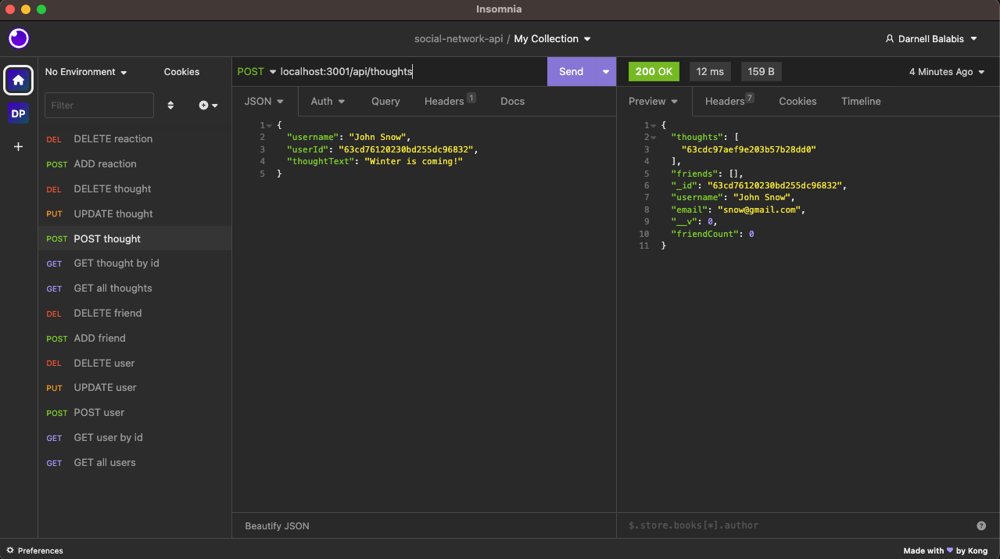

# Social-Network-API

## Description
​This application is an API for a social network web application where users can share their thoughts, react to friends thoughts and create a friend list.​This backend can be used for social media startups, and uses a NOSQL database, Express.js for routing, MongoDB database and Mongoose ODM to handle large amounts of unstructured data. When the application is invoked, the server is started and Mongoose models are synced to the MongoDB database.

API GET routes in Insomnia Core for users and thoughts show data and is displayed in a formatted JSON. API POST, PUT, and DELETE routes in Insomnia Core successfully create, update and delete users and thoughts in the database. API POST and DELETE routes in Insomnia Core successfully create and delete reactions to thoughts and add and remove friends to a user’s friend list.​

## Built With
* JavaScript
* Express.js
* Mongoose ODM
* dotenv

## Installation
1. Clone the Git repository and run as an integrated terminal.
2. run ```npm install```

## Usage
Run ```npm start``` in the integrated terminal CLI.

## Mock-up

The following images show the web application's appearance and functionality:





## Demonstration
https://photos.app.goo.gl/82y1igFNKJkaDmRt7